# Projet N°6 : Implémentez un modèle de scoring

## Mise en situation :
- **Entreprise :** Prêt à dépenser
- **Logo :** 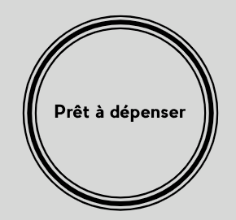
- **Activité :** Propose des crédits à la consommation pour les personnes ayant peu ou pas du tout d'historique de prêt.
- **But :** Mise en place d'un outil de scoring crédit pour calculer la probabilité qu'un client rembourse son prêt immobilier.
- **Jeux de données :** [Base de Données](https://www.kaggle.com/c/home-credit-default-risk/data)
- **Missions :**
    - Construire un modèle de scoring qui donnera une prédiction sur la probabilité de faillite d'un client de façon automatique.
    - Construire un dashboard interactif à destination des gestionnaires de la relation client permettant d'interpréter les prédictions faites par le modèle, et d’améliorer la connaissance client des chargés de relation client.
    - Mettre en production le modèle de scoring de prédiction à l’aide d’une API, ainsi que le dashboard interactif qui appelle l’API pour les prédictions.

## Réalisations :
- **Librairies principales :** Mlflow, divers modèles de ML, Pipeline
- **Etapes réalisées : **
    - **Analyse des données :**
	- Ouvertures des fichiers
	- Création/modifications des variables (par calculs, dummisations, factorisation) grâce au code de Kaggle
	- Merge des fichiers 
	- Création de fichiers moins lourds pour GitHub (25Mo max)
	- Récupération des nouveaux clients pour l'application

    - **Etude du déséquilibre des données et choix d'un modèle de Machine Learning :**
	- Utilisation de MLFlow pour le suivi et la comparaison des runs
	- Création de deux métriques pour ajouter du poids aux faux négatifs
	- **Comparaison de diverses façons de gérer le déséquilibre des données :** SMOTE, Class_Weight, Undersampling, Oversampling

   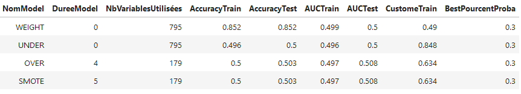
	- **Comparaison de divers modèles de Machine Learning :** DummyClassifier, LogisticRegression, randomForestClassifier et LGBMClassifier (Plus KNN et XGBOOST qui étaient trop longs à runner) :
	- Etude de la variation du poids sur le CLASS_WEIGHT :
   
   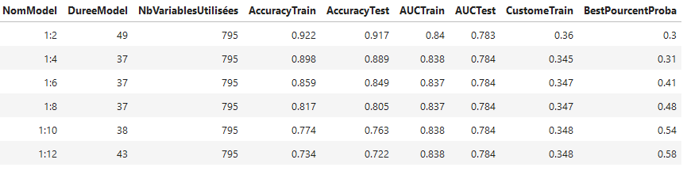

    - **Optimisation du modèle de machine learning choisi :**
	- Réduction du nombre de variables aux variables ayant moins de 70% de NaNs
	- Optimisation du modèle LGBMclassifier via **GridSearchCV** en trois étapes
	- Analyse des résultats via Matrice de Confusion :

   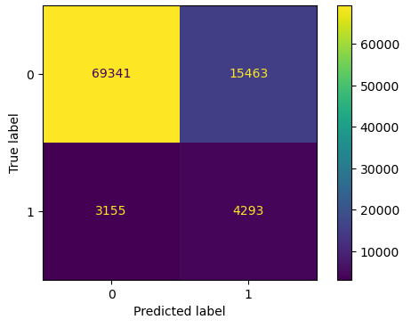
	- Etude de la variation du seuil de probabilité servant à améliorer la métrique perso :

   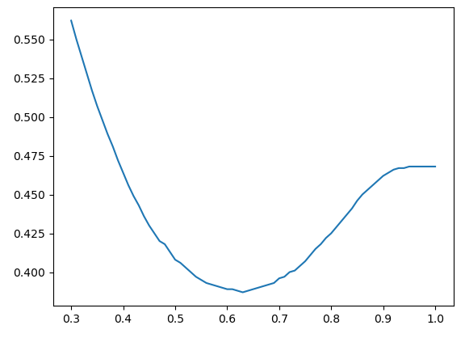
	- Exportation du modèle final en pickle pour utilisation sur mon API Flask.
	- Etude des features importances (Features_importances et SHAPglobale et locale) :

   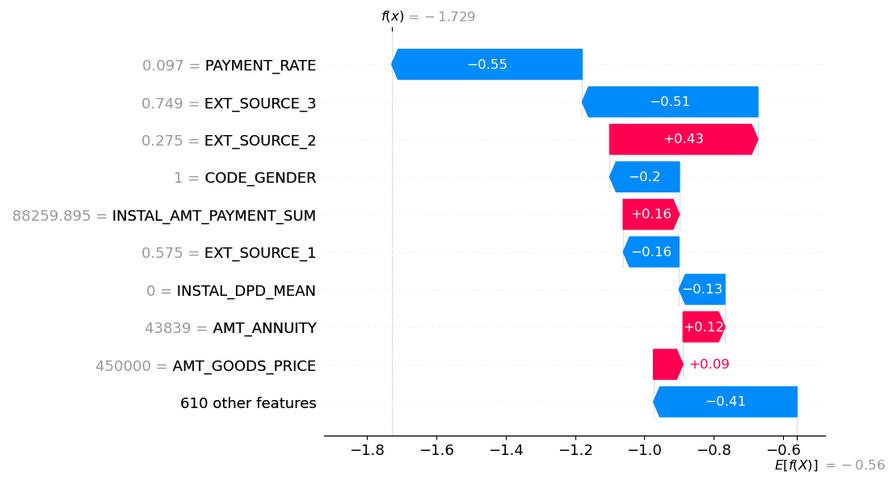
	- Divers tests de prédictions via MLFlow, via l'API Flask en locale et l'API Flask sur Heroku.

    - **Etude du DataDrift :**
	- Réalisé sur les 20 variables issues du features_importances :
   
   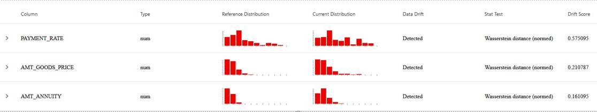
   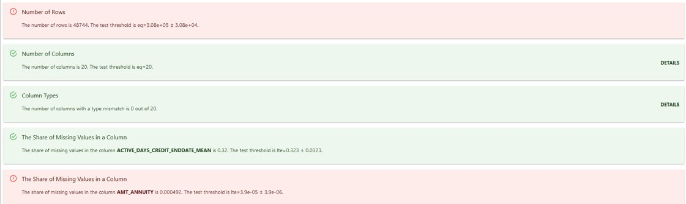

    - Création d'une API FLASK en python hébergé sur Heroku pour la prédiction du remboursement du prêt immobilier.
    - Création d'une application Streamlit qui appelle l'API FLASK :
    	- Interface de l'application :

  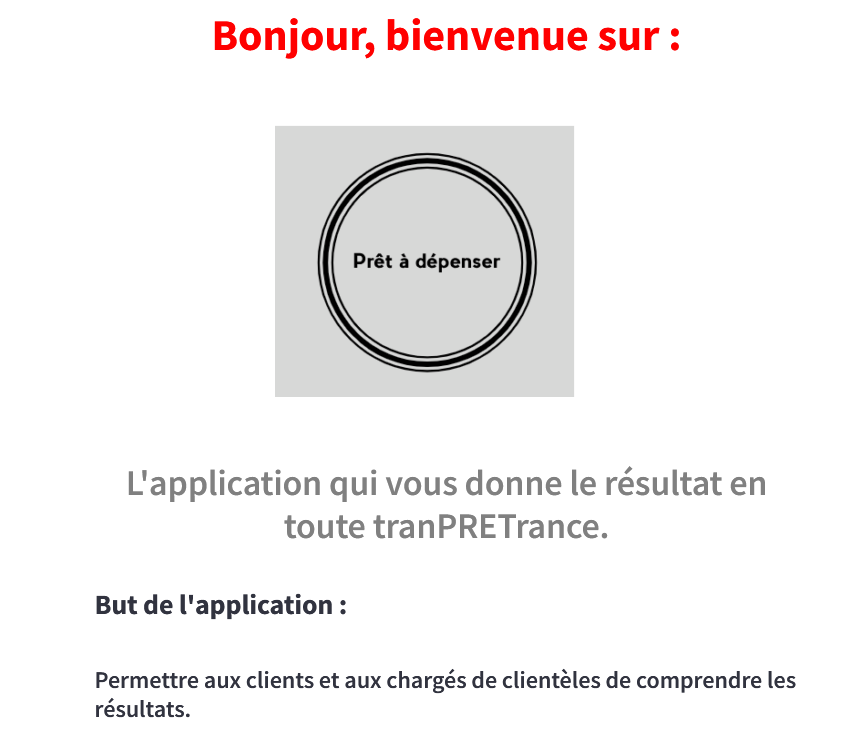
  	- Prédiction pour un client :

  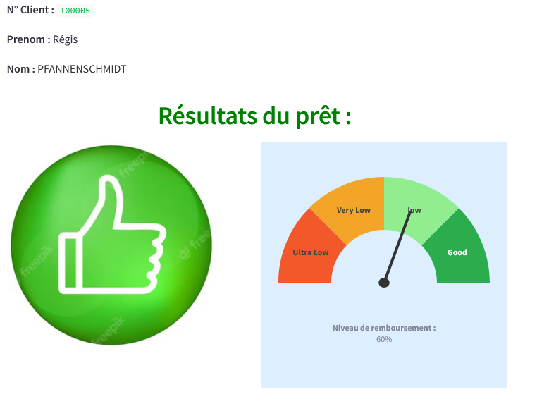
 	- Graphiques sur deux variables pertinentes pour le client :

    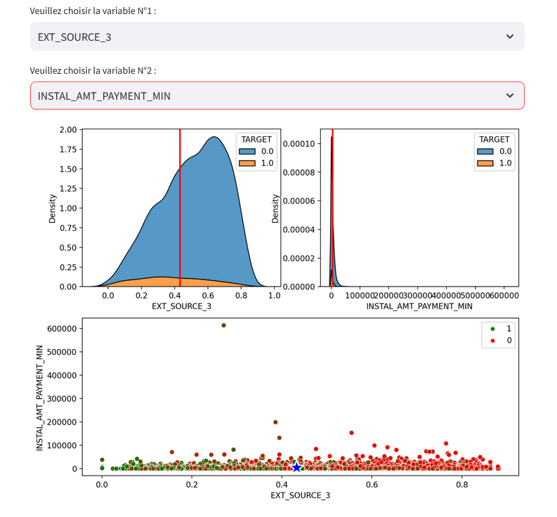

## Les fichiers :

- .github/workflows :
	- development.yml : tests unitaires via Actions de Github
	- workflow.yml : déploiement de FLASK sur HEROKU
- Applications :
	- Donneesgenerees :
		- ModelGrid.sav : modèle de ML final
		- OldDataP7s : petit morceau des données Anciens clients (25M max)
		- ShorNewDataP7 : données des 100 nouveaux clients
		- listNewClients : listes des 100 nouveaux clients
	- Images : 
		- Images utilisées par l'application Streamlit
	- Tests Unitaires : 
		- test_UnitestFlask.py : Tests unitaires pour Flask
		- test_UnitestStreamlit.py : Tests unitaires pour Streamlit
	- AppFlask.py : API FLASK utilisée lors du déploiement
	- Prenoms.csv : liste de prénoms pour l'application
	- patronymes.csv : liste de noms de familles pour l'application

- Notebook :
	- Donneesgenerees:
		- BestVariables : 20 meilleures variables pour le Data Drift
	- ResultatsDataDrift :
		- data_drift_report.html
		- data_stability.html
	- Data Drift.ipynb : Notebook d'analyse du DD
	- DonneesP7.ipynb : Nettoyage des merges des données
	- MLP7-ChoixModèle-Unbalance.ipynb : Notebook de modélisation pour choix du traitement des données déséquilibrées et du modèle de ML.
	- MLP7-OptimisationModel.ipynb : Notebook d'optimisation du modèle (et tests de l'API)
- .gitignore : fichiers à ignorer dans le suivit du projet
- AppStreamlit.py : Application Streamlit (doit être à la racine pour être déployé sur Streamlit.io)
- Procfile : Fichier permettant de déployer FLASK sur Heroku.
- Readme.md : informations générales
- requirements.txt : librairies python à installer lors des déploiements automatiques
- runtime.txt : version de python
